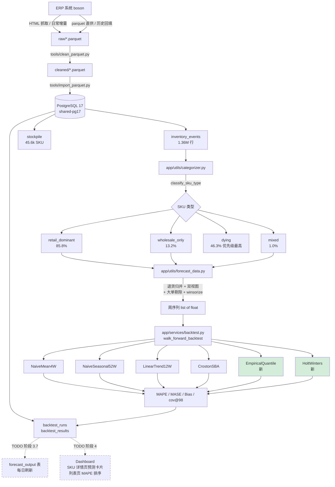

# 数据分析现状盘点

> **创建**: 2026-05-18 ⚠️ 本文档整体状态停在 5 月中，全文刷新待 P5。
> **2026-06-11 起补货策略已形式化**：见 `docs/adr/0001-replenishment-policy.md`
> （(R,S) 周期盘点、horizon 分位数、在途扣减、缺货周剔除）+
> `docs/adr/replenishment-redlines.md`（数值红线 RL-1~10）。
> forecast_output 已上线并扩展 horizon 列；本文 §3.7"待办"等描述已过时。
> **状态**: 阶段 3 主力模型刚 ship（EmpiricalQuantile + HoltWinters），forecast_output 表 + 每日刷新 / Dashboard 集成待办
> **关联 plan**: `docs/superpowers/plans/2026-05-12-forecast-and-backtest.md`（详细技术 plan）

本文档是数据分析这条线的"在哪儿、做了什么、下一步"快速盘点。详细技术决策见关联 plan。

---

## 流程图



---

## 1. 数据底层

### 1.1 历史回填 ETL（已完成）

日常用 HTML 抓取脚本拉 ERP，但 2023-2024 全量历史 HTML 太慢，走 parquet 一次性回填。

| 文件 | 用途 |
|---|---|
| `etl/parquet_cleaner.py` | 纯函数清洗（剔税行 / 拼接条码 / 重复 / 内部账户） |
| `etl/parquet_importer.py` | parquet → DB 核心 |
| `tools/clean_parquet.py` | 清洗 CLI |
| `tools/import_parquet.py` | 导入 CLI |
| `tools/wipe_events.py` | 精确清空（保留 stockpile + manual_grade） |

**清洗规则**（1 年样本 304,507 行验证）：

- 税行 `90000000001`：84 笔
- 拼接条码 `len ≥ 15`：2 笔
- 完全重复：1 笔
- 内部账户 `999*` → archive：14,750 笔（4.9%）
- 最终 cleaned: 289,670 行

### 1.2 当前 DB 规模

| 表 | 行数 | 内容 |
|---|---:|---|
| `inventory_events` | **1,361,065** | 销售 1,338,315 + 采购 22,750 |
| `stockpile` | 45,614 | SKU 主档（active + inactive） |
| `stockpile_locations` | 41,049 | 主档解析后的位置子表 |
| `customers` | 3,666 | 客户 |
| `backtest_runs` | 17（首批 8 + 第二批 12 跑完后 = 20+） | 回测元信息 |
| `backtest_results` | 41,699（首批）+ ~50,000（第二批） | 回测分数明细 |

时间跨度：**2023-01-03 → 2026-05-13**（174 周）

### 1.3 部署环境

`stockpile.db` SQLite 已退役（2026-05-18 cutover）。当前用 PostgreSQL 17 + PostGIS，Coolify 上的 `infrastructure/shared-pg17` 容器；3 个项目共享一实例。详见 `docs/postgres-migration-plan.md`。

---

## 2. SKU 分类层（已完成）

`app/utils/categorizer.py` 提供两套独立分类系统：

### 2.1 4 类生命周期 `categorize_sku_lifecycle`

`new` / `seasonal` / `declining` / `stable` / `unclassified`

判定优先级：`new > seasonal > declining > stable > unclassified`（防冲突）。dashboard 展示用。

### 2.2 4 类销售形态 `classify_sku_type`（预测用）

| 类型 | 全量占比 | 判定 |
|---|---:|---|
| `retail_dominant` | 85.8% | 零售为主（qty ≤ 24 占 ≥ 80%） |
| `wholesale_only` | 13.2% | 几乎纯批发（零售 < 5 单 或 < 5%） |
| `mixed` | 1.0% | 批零混合 |
| `dying` | 46.3% 但优先级最高 | 最后销售距 as_of ≥ 13 周 |

`dying` 优先级高于其他三类，过滤已停售 SKU 防止系统性过度预测（CrostonSBA Bias +0.89 的主要来源）。

两套分类并存：lifecycle 是 dashboard 历史用，sku_type 是预测专用。

---

## 3. 预测数据底座 `app/utils/forecast_data.py`

### 3.1 退货归并 `weekly_demand_series`

**问题**：原始 inventory_events 退货是负数 qty，直接 `SUM` 会被抵消进周需求。

**做法**：`document_no` 内部先净抵（退款找原单），再按周聚合，空周补 0。

### 3.2 双视图 `base_demand_view`

签名：`base_demand_view(barcode, end_date, weeks) → {sku_type, series, exclusion_count, exclusion_qty}`

按 sku_type 分流：

| sku_type | series 处理 |
|---|---|
| `wholesale_only` / `unclassified` / `dying` | `series=None`（不进时序预测） |
| `retail_dominant` | 仅剔单笔异常大单（`is_bulk_order`） |
| `mixed` | 剔大单 + 剔 `unknown`/`mixed` 客户 |

### 3.3 大单识别 `is_bulk_order`

弃用均值（被一单大单拉爆），用 **IQR 法**：

```python
compute_doc_qty_stats(net_qtys) → {median, q1, q3, iqr}
is_bulk_order(qty, stats, k=3.0) → qty > median + k·iqr
```

实战剔除：
- `5203692253593`: 剔 19 单 / 2,521 qty
- `9000000000063`: 剔 50 单 / 3,019 qty

### 3.4 winsorize

`winsorize(values, q=0.95)` 把 ≥ 95 分位的值压到 95 分位本身。给 retail_dominant / mixed 用。

### 3.5 stockout_adjust（🟡 defer）

需要 SKU 级日库存快照表（不存在）。当前 fallback 为 pass-through，等模块 3 补货决策开做时一起补 snapshot 表。

---

## 4. 回测框架 `app/services/backtest.py`

### 4.1 数据结构

```python
@dataclass
class ForecastDist:
    mu: float      # 期望
    sigma: float   # 标准差
    p50: float     # 中位数预测
    p98: float     # 98 分位（用于补货安全线）

class ForecastModel(Protocol):
    name: str
    def fit(self, history: list[float]) -> None: ...
    def predict(self, steps: int = 1) -> ForecastDist: ...
```

### 4.2 模型库 `BASELINES` 字典

| 模型 | 思路 | 适用 |
|---|---|---|
| `NaiveMean4W` | 最近 4 周均值 | 通用 baseline |
| `NaiveSeasonal52W` | 去年同周值 + 残差 std 做 sigma | 通用 baseline；当前 MAPE 冠军 |
| `LinearTrend12W` | 最近 12 周线性回归 | 强趋势 SKU |
| `CrostonSBA` | 间歇需求专用（Syntetos-Boylan-Approximation） | 空周率高的序列 |
| `EmpiricalQuantile` ⭐ | 直接经验分位数 `numpy.quantile` | wholesale_only / 间歇大单 |
| `HoltWinters` ⭐ | 指数平滑（自动 trend ± 季节降级） | 长历史 SKU（≥104 周） |

⭐ 阶段 3 新增（2026-05-18）。

### 4.3 Walk-forward 回测

`walk_forward_backtest(series, model_cls, window_train=13, window_test=4)` — 滚动训练 13 周 + 预测 4 周 → 记录每步 actual / pred / p98。

### 4.4 评分指标

- **MAPE** — Mean Absolute Percentage Error；actual=0 周剔除
- **MASE** — Mean Absolute Scaled Error；分母用 lag-1 naive
- **Bias** — 平均 (pred - actual)；正值过度预测、负值低估
- **coverage_p98** — 实际 ≤ p98 的比例；目标 0.98

### 4.5 DB 表结构

```sql
backtest_runs
  id PK | model_name | view (base_demand/all)
  window_train | window_test | min_weeks
  n_skus_total | n_skus_scored | notes | created_at

backtest_results
  id PK | run_id FK | product_barcode | sku_type
  n_weeks_train | n_weeks_test
  mape | mase | bias | coverage_p98
  mean_actual | mean_predicted
```

### 4.6 HTTP 接口

- `POST /analytics/backtest/run` — 启动一次回测
- `GET /analytics/backtest/runs` — 列出最近 N 次
- `GET /analytics/backtest/results?run_id=N` — 拿某次的明细
- `GET /analytics/backtest/compare?run_a=X&run_b=Y` — 双 run 差分

### 4.7 第一批跑分（PR-C cutover 后，base_demand 视图）

| 模型 | MAPE 中位 | MASE 中位 | Bias 平均 | cov@98 |
|---|---:|---:|---:|---:|
| **NaiveSeasonal52W** | **0.852** 🥇 | 0.937 | +0.013 | 0.912 |
| NaiveMean4W | 0.958 | **0.936** 🥇 | +0.010 | 0.886 |
| CrostonSBA | 0.931 | 1.109 | +0.809 ⚠️ | **0.918** 🥇 |
| LinearTrend12W | 1.042 | 1.046 | **0.000** ✅ | 0.904 |

样本：4,308 SKU。

**关键洞察**：

- NaiveSeasonal52W 双冠（MAPE + MASE）—— 年度周期是最强信号，即使空周率 70%
- CrostonSBA Bias +0.8 严重过度预测，换来最高 cov@98（接住大单峰），代价是平均压货
- LinearTrend12W Bias 几乎 0，最无偏但 MAPE 垫底
- 所有 baseline cov@98 < 0.98 目标 → sigma 被 0 周抑制，正态近似 p98 不够保守 → **正是 EmpiricalQuantile 该补的**

第二批（含新增 2 模型，6 × 2 = 12 runs）正在跑。

---

## 5. 阶段 3 主力模型 ⭐（本周新增）

### 5.1 EmpiricalQuantileModel `app/services/forecast.py`

**适用**：wholesale_only / 间歇序列 / 偶发大单。

**做法**：直接 `numpy.quantile(history, 0.5)` 和 `quantile(0.98)`。

**为啥不用 `mu + 2.054·sigma` 正态近似**：wholesale 序列**非正态**，多 0 周拉低 mu/sigma，正态近似 p98 严重低估真实尾部。看 baseline cov@98 普遍 0.88-0.92 就是这个问题。EmpQuant 直接取经验分位数，应该能上 0.95+。

**测试覆盖**：11 单测（空 / 单元素 / 常数 / 长尾 / wholesale 模式 / 负值 / steps 无关 / refit override / quantile 精度）。

### 5.2 HoltWintersModel `app/services/forecast.py`

**适用**：长历史（≥104 周）+ 有趋势或季节的 SKU。

**自动降级**：

```
n ≥ 104 → 试 trend + 季节 (period=52)
         ↓ 收敛失败
         trend-only (Holt's linear)
         ↓ 失败
         mean (退化保护)

n < 13  → zero_dist
```

**关键细节**（plan §3.4）：σ 用 **in-sample 残差 std**，不是原始序列 std。原始 std 被 0 周抑制；残差 std 更接近真实预测误差。

mu clip 到 ≥ 0（业务量非负）。

**测试覆盖**：9 单测（empty / short / medium-trend / long-seasonal / constant / p98 ≥ mu / mu 非负 / refit override）。

---

## 6. 待办

| 项 | 阶段 | 状态 |
|---|---|---|
| 全量 backtest（6 模型 × 2 视图 = 12 runs） | 验证 | 🟡 正在跑 |
| 新品规则（`days_since_first_sale < 90` → erp_category 均值） | 3.5 | ⬜ |
| `forecast_output` 表 + 每日刷新 cron | 3.7 | ⬜ |
| SKU 详情页"预测分布"卡片 | 4.1 | ⬜ |
| SKU 详情页"回测历史"小图 | 4.2 | ⬜ |
| 列表页加排序列（上周 MAPE / 命中率） | 4.3 | ⬜ |
| 模型失效 chip（命中率 < 阈值自动标） | 4.4 | ⬜ |
| 数据补齐回归（2023-2024 HTML 抓完后重跑） | 5 | ⬜ 阻塞于 0.1 |
| 模块 3 补货决策（s/S、压货预警） | V1.5+ | ⬜ 不做 |

---

## 7. 明确不做（V1.5+）

- 模块 3 补货决策引擎（s/S、压货预警、override_log）
- LT 实测分布统计（采购单时间戳，数据基础不够）
- SKU 级日库存快照表（缺货修正先 fallback）
- 全面重做 categorizer 4 类分类（保留并行）
- 手工标签体系迁移（8 个标签继续用）

---

## 8. 关键设计决策记录

详见 `docs/superpowers/plans/2026-05-12-forecast-and-backtest.md` §五。摘要：

1. **路线**：先 baseline + 回测框架，再 HW（回测是 evaluator，没它"完善算法"=盲调）
2. **客户三分类降级**：文档要求 `foreigner/cn_replenish/cn_bulk`，现状是 `foreign/chinese/mixed/unknown`；用 `is_bulk_order` 绕过"鸡生蛋"
3. **季节性不可靠期**：只有 402 SKU 满足 104 周（1.3%）；HW 带季节降级为"少数 SKU 跑"，不影响主流程
4. **parquet 是一次性历史回填，HTML 是长期主路径**：工具放独立文件不污染主 CLI
5. **退货归并强制做**：document_no 内净抵，否则负数 qty 直接进周需求 = bug

---

## 9. 待决决策（2026-05-18 晚发现，2026-05-19 已处理）

### 9.1 backtest 框架 window_train=13 的设计问题 ✅ 已选 B 落地

> **2026-05-19 更新**：选项 B 已落地。`walk_forward_backtest` 改为累积训练 `series[:start+window_train]`，`window_train` 现在是**最小训练长度**而非固定窗口宽度。`pytest tests/test_backtest_service.py tests/test_forecast_service.py` 63/63 全绿。

原问题（保留作历史记录）：

- `walk_forward_backtest` 写死 `window_train=13`
- 每次 `fit()` 只看 13 周
- **NaiveSeasonal52W 永远进 fallback**（要 ≥ 52 周才用 lag-52）
- **HoltWinters 同样问题**（季节项至少要 ≥ 104 周）
- 实际效果：所有模型的 mu 计算趋同 mean(13)，差异主要在 sigma / p98

**佐证**：EmpiricalQuantile run（id=28）和 NaiveSeasonal52W run（id=25）的 med_MAPE / med_MASE / avg_Bias **完全相同 (0.852 / 0.937 / 0.013)**，因为两者 mu = mean(13)。唯一差异在 cov@98（0.912 vs 0.924，+1.2 pp）。

### 9.2 HoltWintersModel 跑太慢 ✅ 已处理

> **2026-05-19 更新**：`HoltWintersModel._try_fit_seasonal` / `_try_fit_trend` 改用 `fit(optimized=True, use_brute=False, minimize_kwargs={"options": {"maxiter": 50}})`。本地 130 周季节性测试单 SKU 秒级返回（之前 pathological 收敛）。

### 9.3 SKU 来源分群（国外 / 国内）✅ 已落地

> **2026-05-19 更新**：`app/services/sku_origin.py` 落地（commit `abfb214` + `801318d`）。
> 规则：supplier_id 前缀（CN / GR/ES/TR/BG/NE/IT）优先 → 无采购记录回退 product_model 长度（5 位 CN / 13 位 FOREIGN）。
> 端点：`GET /analytics/backtest/summary?run_id=N&origin=FOREIGN|CN|unknown|all`（SQL 端 CTE JOIN aggregate）。

**run_id=44 EmpQuant base_demand 验证**：

| origin | n | MAPE | MASE | Bias | Cov@98 |
|---|---:|---:|---:|---:|---:|
| FOREIGN | 1572 | 0.806 | 0.952 | 0.227 | 0.971 |
| CN | 2701 | 0.821 | 0.995 | 0.333 | 0.972 |
| all | 4279 | 0.814 | 0.978 | 0.296 | 0.972 |

FOREIGN 货比 CN 货所有指标都更好（MASE 0.95 vs 0.99，bias 低 32%）。
说明用户关心的国外货数据质量足以支撑生产用 EmpQuant 模型。

### 9.4 当前 DB 状态（截至 2026-05-18 18:00）

- 第一批（PR-C 后）8 runs：run_id 10-17（4 baseline × 2 view，已完整）
- 第二批已完成 5 runs：run_id 24-28（4 baseline + EmpQuant，仅 base_demand view）
- 第二批 6/12 起 HW base_demand 因慢被杀，未生效
- backtest_results 表共约 50,000 行（first 8 runs + last 5 runs）

