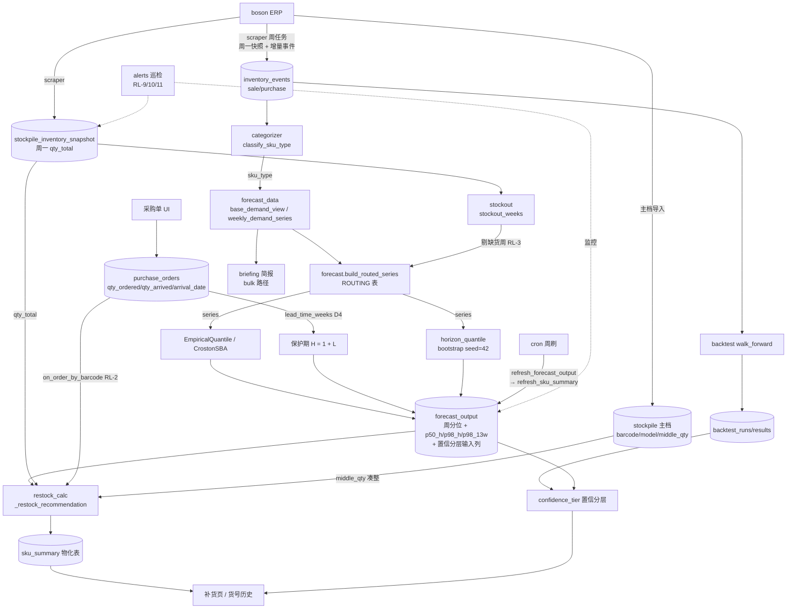

# 系统心智模型 — forecasting → classification → replenishment

> **Date**: 2026-06-12（P5 判断层产出，作者 Fable 5）
> **体裁**: 领域语义层 —— 不是现状盘点（那是 `docs/data-analytics-overview.md`，
> 已是历史快照），是**改任何一环之前先来查的那张图**：数据怎么流、每个模块
> 假设世界是什么样、耦合点在哪、改 X 会波及谁。
> **维护约定**: 新增耦合点 → 登记到第四节并编号；消除耦合点 → 不删条目，
> 标 ~~删除线~~ + 消除方式（耦合的历史和现状一样有教学价值）。

---

## 一、一页数据流

**一句话版本**：事件流（sale/purchase）养出分类和需求序列；快照流（周一库存）
养出缺货修正；两者在 `build_routed_series` 汇合选模型出预测；预测 + 库存 +
在途 + 中包在 `_restock_recommendation` 汇合出推荐；物化进 `sku_summary` 给页面。
回测是旁路 evaluator，产出喂置信分层。

---

## 二、层职责与节奏

| 层 | 模块 | 输入 → 输出 | 触发节奏 | 真源 |
|---|---|---|---|---|
| 采集 | scraper/ | ERP HTML → events + 周一快照 | 周任务（周一） | run manifest 闸 |
| 分类 | categorizer | doc-net 分布 + last_sale → sku_type | 每次调用现算（无表） | 代码阈值常量 |
| 需求视图 | forecast_data | events → 周序列（按类型清洗） | 每次调用现算 | — |
| 缺货 | stockout | 周一快照 → 缺货周集合 | 每次调用现算 | snapshot 表 |
| 预测 | forecast | series → forecast_output 行 | **cron 周刷** | forecast_output |
| 补货 | restock_calc | FO + 库存 + 在途 + 中包 → 推荐 | 随 summary 刷新 | sku_summary |
| 回测 | backtest | series → runs/results | 手动/cron 触发 | backtest_* 表 |
| 分层 | forecast_eval | FO 行 + 最新 prod run → tier | 页面现算 | — |
| 监控 | alerts | 各表新鲜度/分布 → Telegram | cron 日巡 | — |

关键节奏事实：**库存可见性是周批量的**（ADR-0001 D1 的根据），分类和需求视图
没有物化表（每次现算，所以"改阈值=立即全局生效"），预测和补货推荐有物化
（所以"改完要刷新，不刷新就是旧值"）。

---

## 三、每个模块以为世界是什么样（隐含假设清单）

改模块前先读它的假设；破坏假设而不改模块 = 静默错误。

### weekly_demand_series（forecast_data）
- 退货能按 `document_no` 找到原单净抵；净量 ≤0 的 doc 整体丢弃（周需求非负）。
- 空 `document_no`（None 和 ''）= 独立事件，**绝不**合并成一个虚拟大单
  （bulk SQL 路径曾在 NULL/'' 上翻车，review 阻断项，有一致性测试守护）。
- 周界 = ISO 周一；`event_at` 前 10 字符可解析为日期。

### categorizer.classify_sku_type
- doc-net 分布跨期平稳（全历史一把算，**无 as_of 上界** —— 审计 LK-1，
  生产 as_of=today 时无害，回测/历史时点调用时是 look-ahead）。
- "死活"由最后销售距今决定：≥26 周深度死亡不分型；[13,26) 边际带
  wholesale_only 不判死（批发 ADI p90≈9 周，13 周只是正常下单间隔）。
- 阈值常量是 spike 实证锁定的，不是可随手调的参数 —— 改它触发 C3。
- 生命周期分类（new/seasonal/…）与 sku_type **正交**，不参与预测路由，
  且已知退化（97% unclassified，ADR-0002 F4）。

### base_demand_view
- "大单 = 噪声"**仅对 retail_dominant/mixed 成立**；wholesale 的大单是需求本体。
- IQR 阈值（median + 3·IQR）用全历史 doc-net 估计，假设分布稳定（同 LK-1）。
- mixed 的客户过滤假设 customer_type 维护是可信的。

### stockout
- 周一快照存在 ⇒ 该周库存状态已知；qty_total ≤ 0 ⇒ 物理无货（与
  restock_calc 负库存口径**必须**一致，RL-7）。
- 无周一快照 ⇒ unknown ⇒ **不判缺货**（保守：宁可少剔，预测偏低方向）。
  scraper 漏抓的代价由 RL-10 巡检兜底。

### 预测模型（EmpiricalQuantile / CrostonSBA）
- 输入序列**非负**（清洗在上游，模型不裁负值 —— AGENTS.md 红线 A11）。
- 周间 i.i.d.；多步预测 = 单步重复（边际分布相同）。
- 序列可以有"日历洞"（缺货周剔除后），i.i.d. 模型不在乎 —— 但 lag 类模型
  （NaiveSeasonal52W/HoltWinters）在乎，所以它们的对比口径用 all 视图（D7）。
- EmpQuant：<30 周时尾部收缩（min(emp_p98, p90×1.5)，RL-4）。
- CrostonSBA：非零周 ≥5 才有意义（interval 估计噪声闸，ADR-0002 D1）。

### horizon_quantile
- i.i.d. bootstrap（与模型假设一致）；固定 seed=42（可复现，红线 A9）。
- 正自相关会让真实尾部更厚 —— 已声明限制，验收 = coverage_h4（审计 MT-3）。

### refresh_forecast_output
- H = 1 + L，L 来自 `lead_time_weeks`（先验 4 周 / PO 样本 ≥20 自动切经验 p90）。
- 写入 = delete+insert（跨方言 upsert）；**全量模式收尾清僵尸行**
  （转 dying/路由变更后的旧预测不许残留）。
- `n_weeks_history` 语义 = **有效训练周数**（剔缺货后），不是日历周数。

### _restock_recommendation
- `forecast_output` 的 p50_h/p98_h **已是 H 周总量**，消费端再乘周数 = RL-1 复发。
- IP = max(0,qty_total) + on_order；on_order 排除 cancelled/void、超收按 0。
- 回退链 forecast → velocity×8 → last_purchase 的**第三级不扣 IP**（last_pq
  直接作推荐，历史行为，改它先想清楚语义）。
- barcode ↔ product_model 的桥是启发式（C2），桥断 = qty 查不到 = None。

### confidence_tier
- mase/coverage 来自**最新 (EmpiricalQuantile, base_demand) run**；
  路由到 CrostonSBA 的 wholesale SKU 在该 run 里没有行 → missing_backtest
  → low（诚实降级，不是 bug —— 见 C8）。

---

## 四、耦合点登记簿

> C1-C4 源自 ADR-0001 附录；C5 起为本文档新登记。

- ~~**C1 周粒度系数链**~~（已消除，#41）：forecast_output 存周分位 → restock ×8
  → 快照 ×13 三处隐式同一周粒度。消除方式 = 改存 horizon 分位数列，消费端
  禁再乘系数（红线 A4 防复发）。
- **C2 barcode ↔ product_model 双实现桥**：`restock_calc._lookup_qty`
  用"13 位条码取倒数第 2-6 位"匹配快照表 model；`stockout.py` 走 Stockpile
  表查 model。**同一映射两种实现**，主档格式变更会让两处不同步断裂。
  收敛方向：抽一个共享 resolver（待办）。
- **C3 分类 → 需求视图 → 预测 → 回测 的单向静默传染**：categorizer 阈值改动
  ⇒ base_demand 分流变 ⇒ 所有下游预测输入变 ⇒ **历史回测结果全部失效**。
  防御 = AGENTS.md 红线 B3（PR 必须声明回测失效并重跑标定脚本）。
- **C4 缺货判定依赖周一快照存在性**：scraper 漏抓一周 = 该周删失修正静默
  失效。防御 = RL-10 巡检（`alerts._missing_monday_snapshots`）。
- **C5 sku_type 三处独立计算**：①单 SKU 路径（classify_sku_type）、
  ②bulk 路径（base_demand_views_bulk 内联 `_classify`）、③回测
  （_build_series→base_demand_view）。语义一致性靠
  `test_bulk_matches_per_sku_view` 守护 —— 改 dying 阈值/分类逻辑必须三处
  同步（#43 就是 ①② 同步改的案例）。
- **C6 horizon_weeks 冻结在行内**：L 变化（先验→经验切换、配置改动）后，
  forecast_output 旧行的 p50_h/p98_h 仍按旧 H 算，直到下次周刷。消费端
  读行内 `horizon_weeks` 而非实时算 —— 设计正确（行自洽），但意味着
  "改 L 不刷新 = 新旧口径并存一周"。
- **C7 forecast_output 是预测的唯一交接面**：写端只有 refresh_forecast_output；
  读端 = restock/summary、compute_forecast_snapshot、eval 看板、briefing。
  新读端两件套义务（computed_at 过期 + stockout_weeks_excluded）= 红线 B1。
- **C8 置信分层与路由的错位**：分层 join 的是 EmpiricalQuantile run，
  CrostonSBA 路由的 wholesale SKU 天然 missing_backtest → low。这是**已知
  且接受**的诚实降级（ADR-0002 D3"诚实不装"）；若未来给 wholesale 跑专属
  backtest run，分层 join 逻辑要同步扩（别只加 run 不改 join）。
- **C9 物化表刷新顺序**：cron 路径 `refresh_forecast_output()` **之后必须**
  `refresh_sku_summary()`（routes_analytics 已保证）。只刷前者 = 补货页
  继续用旧推荐；只刷后者 = 推荐基于旧预测。手动触发任一时记住另一半。
- **C10 回测 min_weeks 口径 ↔ 置信分层 nonzero 口径**：
  `demand_history_stats` 的 nonzero_weeks 注释声明"与 backtest min_weeks
  口径一致"——两处对"非零周"的数法若分叉，分层阈值（≥12/≥6）的标定就漂了。

---

## 五、改 X 前查这张表（impact lookup）

| 你要改的 | 直接波及 | 静默波及（容易漏） | 必做动作 |
|---|---|---|---|
| categorizer 阈值 / dying 周数 | 分类结果 | C3 全链 + C5 三处同步 + 边际带 SKU 进出预测池 | 重跑 `tools/calibrate_model_routing.py` 贴 PR（红线 B2/B3）；三处一致性测试 |
| ROUTING 表 / 新增模型 | refresh 写入 | C8 分层 join、eval 看板 _COMPARE_MODELS、僵尸行清理 | 标定脚本 + RL-11 阈值复核 |
| base_demand 清洗规则 | 预测输入 | 回测失效（C3）、briefing bulk 路径同步 | bulk/单 SKU 一致性测试；声明回测失效 |
| forecast_output 列 | schema | C7 全部读端、alembic 迁移、僵尸行清理逻辑 | models.py + autogenerate 成对（红线 C6） |
| _restock_recommendation 公式 | 推荐值 | golden 快照变红（解释或修 bug）、property 套件、C9 刷新 | 三件套同步（红线 D1/D2） |
| scraper 节奏 / 快照表 | 缺货判定 | C4 + R=1 周的 (R,S) 前提（ADR-0001 D1 写死 R=1） | 动 R = 重开策略 ADR，不是改配置 |
| lead time 配置 / 切换逻辑 | H | C6 新旧口径并存窗口、p50_h 全量变化幅度 | 改后触发全量 refresh + summary |
| stockout 判定口径 | 缺货集合 | RL-7 双口径一致（restock_calc 同步）、RL-3 剔除量、szw8 分层输入 | 口径一致性测试 |
| middle_qty 主档语义 | 凑整 | churn 闸阈值（max(1 中包, 0.25S)）连带变 | property 套件回归 |
| 周界定义（ISO 周一） | 一切按周的东西 | snapshot 对齐、weekly series、stockout 全部假设同一周界 | 别改。真要改 = 全链重写 |

---

## 六、数值守护网（不变量在哪被守着）

| 守护层 | 位置 | 守什么 |
|---|---|---|
| 确定性样例 | `tests/test_replenishment_redlines.py`（64） | RL-1~8 逐条手算预期 |
| 随机不变量 | `tests/test_replenishment_properties.py`（18） | 非负/单调/凑整/在途覆盖/断货 override 全输入空间 |
| 精确数值基线 | `tests/test_forecast_golden.py`（12） | 防重构数值漂移（基线变更须 PR 解释） |
| 运行时巡检 | `alerts.py`（cron 日巡 + Telegram） | RL-9 预测过期 / RL-10 快照缺失 / RL-11 路由退化 |
| Review 清单 | `AGENTS.md` Review 红线 24 条 | 机器可执行的 reject 判据 |
| 方法论 | `docs/thesis/回测方法论审计-2026-06-12.md` | 回测结论的可信边界 + 修复清单 |

## 七、文档图谱

- 决策为什么这样：`docs/adr/0001-replenishment-policy.md`（策略）、
  `0002-model-selection.md`（路由）
- 哪些改法会算错数：`docs/adr/replenishment-redlines.md`（RL-1~11）
- 回测结论可信边界：`docs/thesis/回测方法论审计-2026-06-12.md`
- 历史现状快照（2026-05-18 口径）：`docs/data-analytics-overview.md`
- 本文档：语义层 —— 流向、假设、耦合、波及
